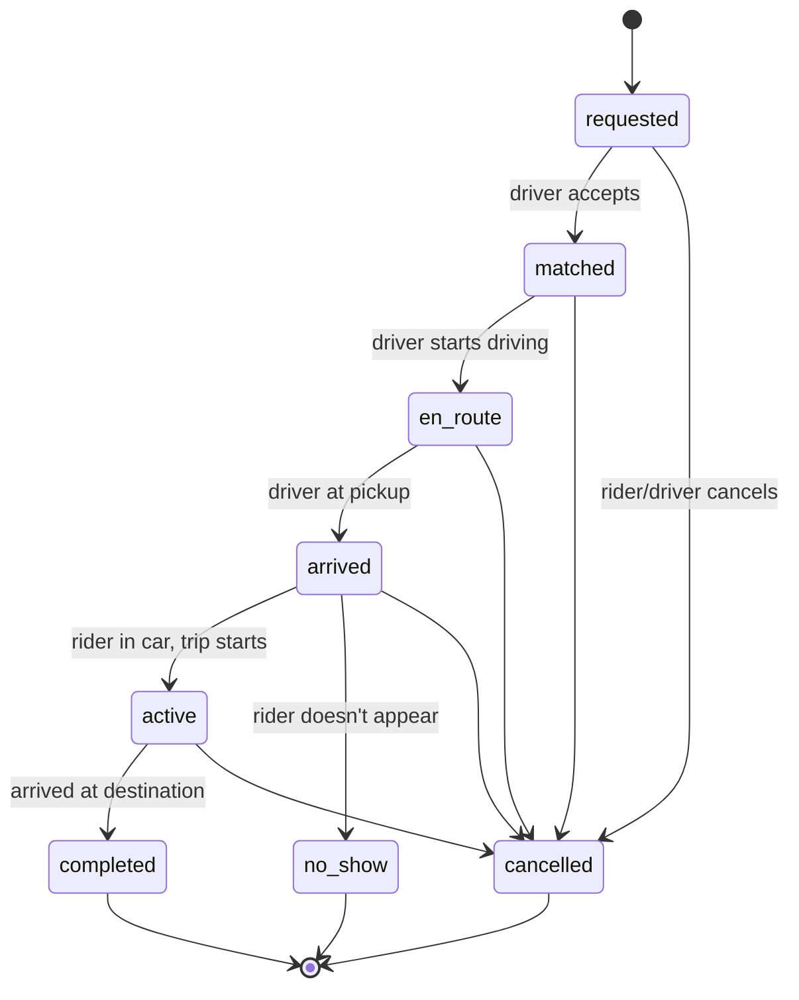
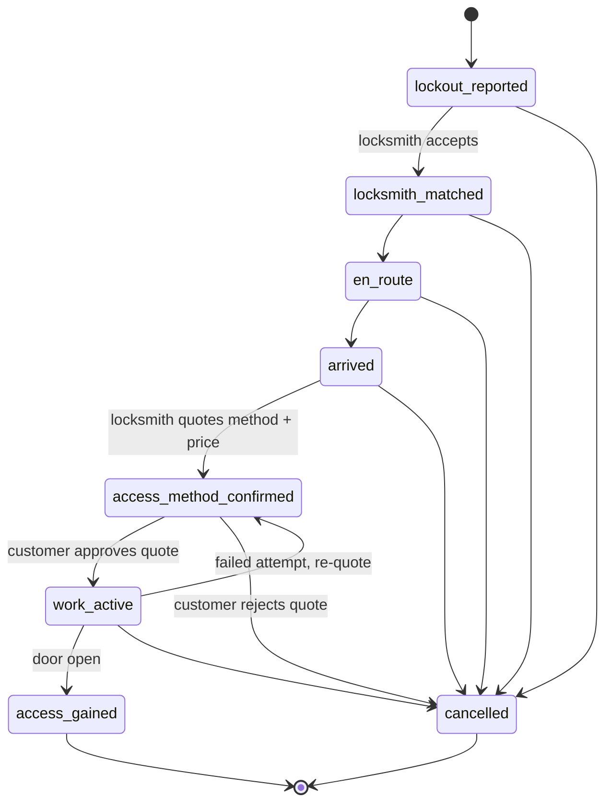
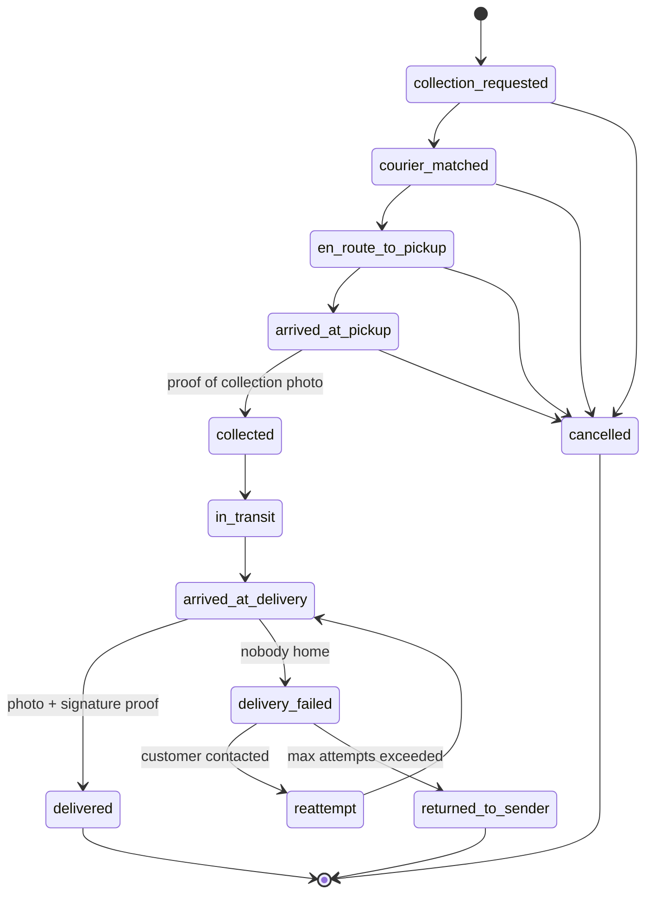
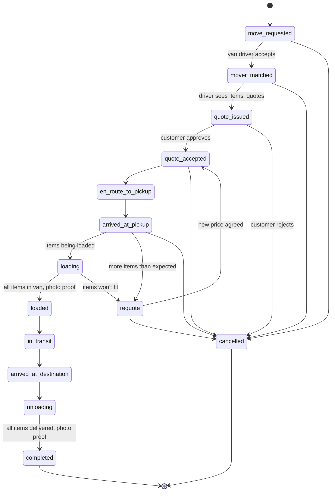
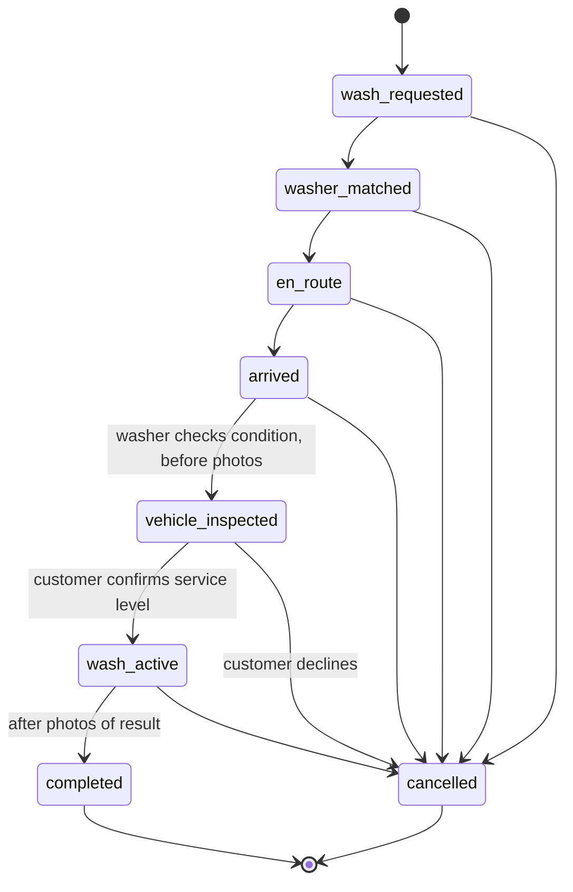
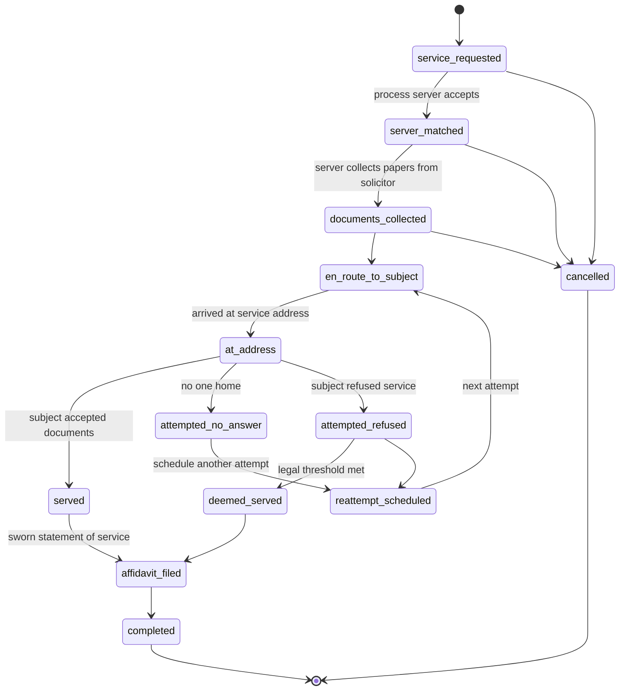
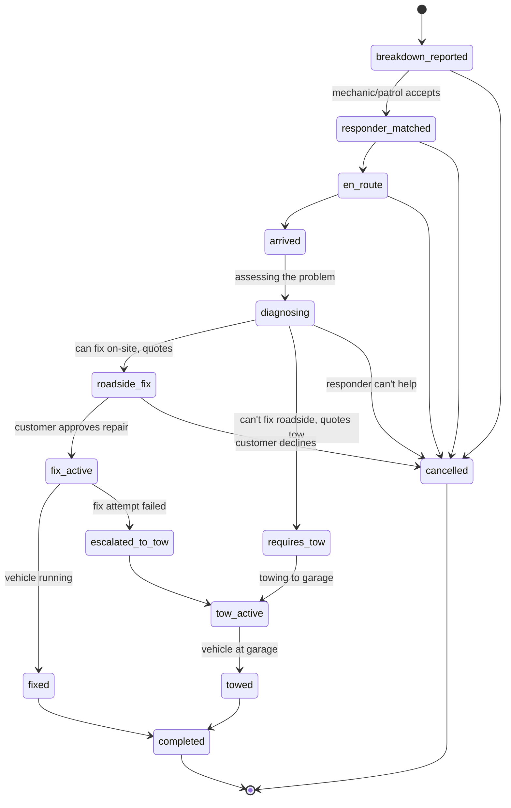
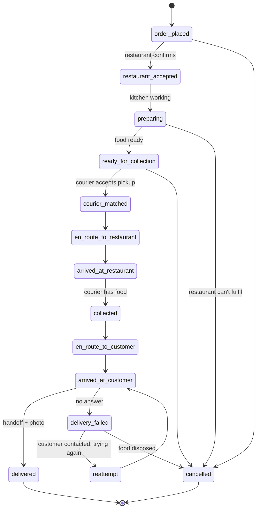
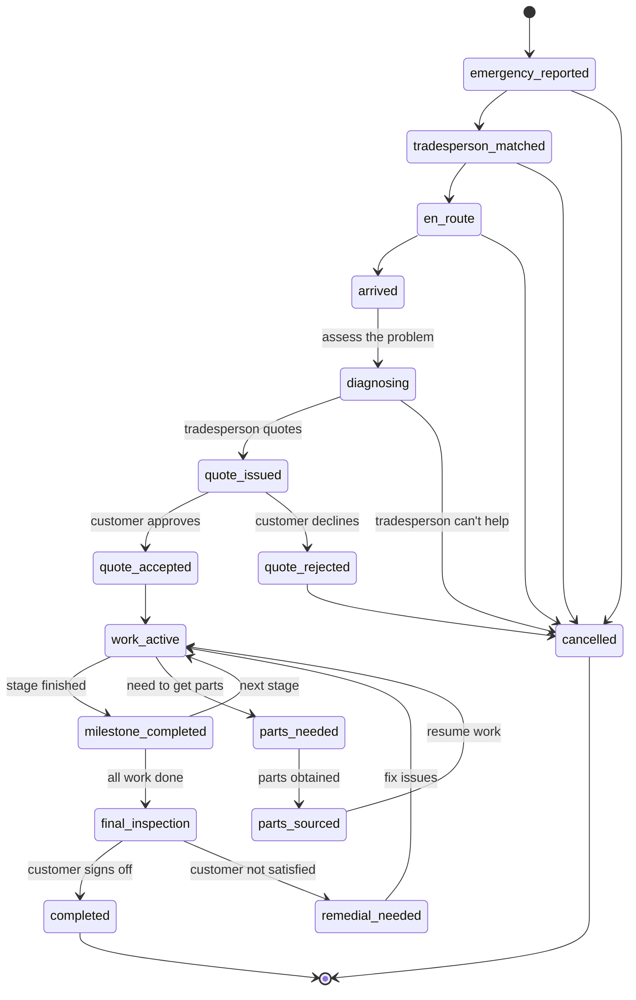
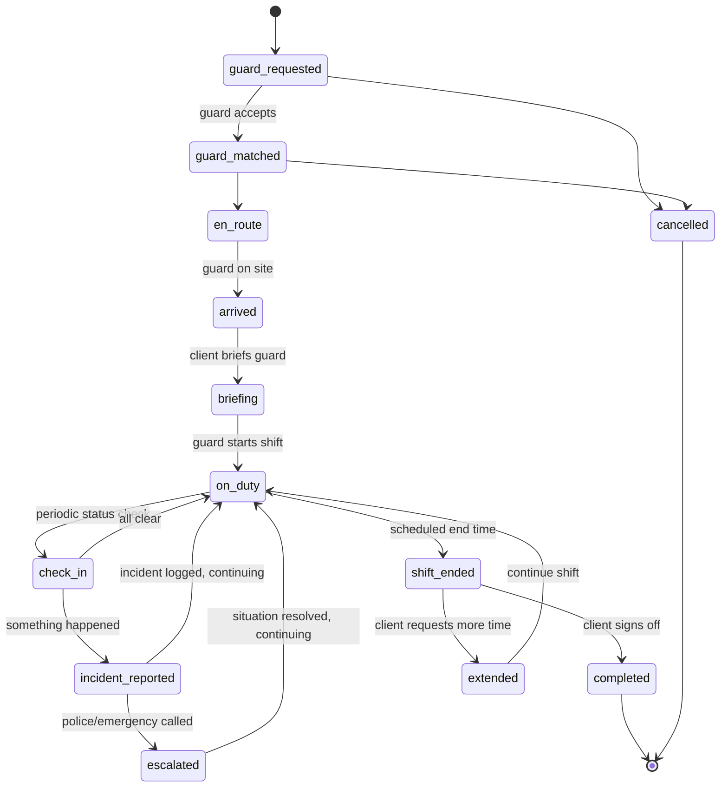

# Use Case State Machines

**Last Updated**: 2026-02-08

This document contains detailed state machine diagrams, design decisions, edge cases, and regulatory requirements for the top 10 DonkeyRide use cases. Each state machine has been sense-checked against real-world scenarios to identify protocol gaps.

---

## Table of Contents

1. [Ridesharing (DonkeyRide)](#1-ridesharing-donkeyride)
2. [Locksmith (DonkeyKnock)](#2-locksmith-donkeyknock)
3. [Parcel Delivery (DonkeyPack)](#3-parcel-delivery-donkeypack)
4. [Man with Van (DonkeyHaul)](#4-man-with-van-donkeyhaul)
5. [Mobile Car Wash (DonkeyShine)](#5-mobile-car-wash-donkeyshine)
6. [Court Process Serving (DonkeyServe)](#6-court-process-serving-donkeyserve)
7. [Roadside Assistance (DonkeyRescue)](#7-roadside-assistance-donkeyrescue)
8. [Food Delivery (DonkeyEats)](#8-food-delivery-donkeyeats)
9. [Emergency Trades (DonkeyFix)](#9-emergency-trades-donkeyfix)
10. [Security Guard Dispatch (DonkeyGuard)](#10-security-guard-dispatch-donkeyguard)
11. [Pattern Summary](#pattern-summary)
12. [Mandatory Regulatory Checks](#mandatory-regulatory-checks)

---

## 1. Ridesharing (DonkeyRide)

**Status**: Implemented

**Roles**: rider / driver | **Pricing**: distance + time + surge | **Discovery**: geohash

**NIPs used**: core, stakes, reputation, disputes, discovery, safety, navigation, payments

**Rating criteria**: Overall (40%), Punctuality (20%), Safety (20%), Courtesy (20%)

### Gaps Identified

- **`no_show` terminal state** — added. Driver arrives, rider doesn't appear. Triggers automatic stake forfeiture for the absent party. Distinguished from mutual cancellation.
- **`active` → `cancelled` ambiguity** — a driver stopping mid-ride is a safety incident, not a normal cancellation. The cancellation event's `reason` tag distinguishes these, with `abandoned` triggering safety escalation.
- **Mid-ride destination change** — not a state concern. Handled as a price renegotiation event within the `active` state.

---

## 2. Locksmith (DonkeyKnock)

**Status**: Implemented

**Roles**: customer / locksmith | **Pricing**: flat rate (quoted) | **Discovery**: geohash

**NIPs used**: core, stakes, reputation, disputes, discovery

**Rating criteria**: Overall (30%), Punctuality (20%), Price transparency (30%), Skill (20%)

### Gaps Identified

- **Back-transition for failed attempts** — added: `work_active` → `access_method_confirmed`. Locksmith tries picking (fails), re-quotes for drilling. Essential because drilling costs 3x picking and the customer must approve.
- **Guarantee period** — modelled as a linked follow-up task (`["linked_task", "<original_id>", "guarantee"]`). If the lock fails within 30 days, a linked task references the original.

---

## 3. Parcel Delivery (DonkeyPack)

**Status**: Implemented

**Roles**: sender / courier | **Pricing**: distance + weight | **Discovery**: geohash

**NIPs used**: core, stakes, reputation, disputes, discovery, navigation, payments

**Rating criteria**: Overall (30%), Punctuality (25%), Package care (25%), Communication (20%)

### Gaps Identified

- **`delivery_failed` state** — added. Nobody home is the #1 real-world problem. Options: leave with neighbour, leave in safe place, return to sender, reattempt.
- **`returned_to_sender` terminal state** — added. If delivery fails after multiple attempts, the parcel goes back.
- **Cancellation after `collected`** — the courier has the parcel. Cancellation after custody transfer forces a return-to-sender flow, not a simple cancel.

---

## 4. Man with Van (DonkeyHaul)

**Status**: Designed

**Roles**: customer / mover | **Pricing**: quote-based | **Discovery**: geohash

**NIPs used**: core, stakes, reputation, disputes, discovery, navigation

**Rating criteria**: Overall (25%), Punctuality (20%), Care of items (30%), Value for money (25%)

### Design Decisions

- **`requote` loop** — essential. Customers understate job size; movers inflate on arrival. Explicit requote state with photo evidence prevents both scams.
- **`loading` and `unloading` as separate states** — damage claims need to know when damage occurred. Photos at `loaded` and `completed` create an evidence trail.
- **Cancellation after `loading`** — the mover has belongings. Forces an `unloading` → return items flow.

**Regulatory**: Consumer Rights Act 2015 (goods-in-transit liability). No mandatory licensing for van drivers in the UK.

---

## 5. Mobile Car Wash (DonkeyShine)

**Status**: Designed

**Roles**: customer / washer | **Pricing**: flat rate (tiered: basic/standard/premium) | **Discovery**: geohash

**NIPs used**: core, stakes, reputation, disputes, discovery

**Rating criteria**: Overall (30%), Quality (35%), Punctuality (20%), Value (15%)

### Design Decisions

- **`vehicle_inspected` state** — before/after photos are standard industry practice. The "before" photo protects the washer from "you scratched my car" claims. The "after" photo proves work was done.
- **Simple state machine, intentionally.** No custody transfers, no complex failure modes.
- **Tiered pricing** (basic exterior, full valet) is metadata on the request, not a state machine concern.

**Edge cases**: Rain during wash — `wash_active` → `cancelled` needs partial completion and partial payment semantics. Pre-existing damage — `vehicle_inspected` photos establish baseline.

**Regulatory**: Minimal. Environmental regulations on water run-off may apply in some areas.

---

## 6. Court Process Serving (DonkeyServe)

**Status**: Designed

**Roles**: instructing party / process server | **Pricing**: flat rate + per-attempt | **Discovery**: geohash

**NIPs used**: core, reputation, discovery, navigation

**Rating criteria**: Overall (25%), Reliability (30%), Evidence quality (25%), Communication (20%)

### Design Decisions

- **Cryptographic proof of service** — GPS proof of being at the address, timestamped photo/video, signed Nostr events. An immutable, verifiable evidence chain that courts would accept.
- **`attempted_no_answer` → `reattempt_scheduled` loop** — servers typically make 3-4 attempts at different times of day.
- **`attempted_refused` → `deemed_served`** — jurisdiction-dependent. In England & Wales (CPR Part 6), refusal to take documents can still constitute valid service.
- **`affidavit_filed` as mandatory state** — ensures legal paperwork is done. The Nostr event trail essentially IS the affidavit.
- **Encryption mandatory** — court documents contain highly sensitive information. All document exchange via NIP-17 gift wrap.

**Edge cases**: Substituted service (court-ordered service by post/email). Evasion (subject actively avoids service).

**Regulatory**: Courts Act 2003, CPR Part 6 (England & Wales). Process servers are not specifically regulated but must comply with court rules.

---

## 7. Roadside Assistance (DonkeyRescue)

**Status**: Designed

**Roles**: motorist / responder | **Pricing**: diagnosis free, then quoted | **Discovery**: geohash + road network

**NIPs used**: core, stakes, reputation, disputes, discovery, safety, navigation, payments

**Rating criteria**: Overall (25%), Response time (30%), Diagnostic accuracy (25%), Communication (20%)

### Design Decisions

- **Diagnostic fork** (`roadside_fix` vs `requires_tow`) — the AA/RAC model: arrive, diagnose, attempt fix, tow if needed. The fork lets the customer see a quote and decide.
- **`escalated_to_tow`** — roadside fix attempted but failed. Common: jump-start fails because alternator is dead.
- **Safety critical** — breakdowns happen on motorways. Safety alerts enabled, live location sharing automatic.

**Edge cases**: Parts ordering ("back in 2 hours" — needs `parts_needed` pause state). Relay service (linked rideshare task from completed breakdown). Wrong responder type (skill/equipment matching needed).

**Regulatory**: Minimal for breakdown response. Towing may require operator licensing in some jurisdictions.

---

## 8. Food Delivery (DonkeyEats)

**Status**: Designed

**Roles**: customer / courier (+ restaurant as third party) | **Pricing**: distance + flat fee | **Discovery**: geohash

**NIPs used**: core, stakes, reputation, disputes, discovery, navigation, payments

**Rating criteria**: Overall (25%), Speed (30%), Food condition (25%), Communication (20%)

### Design Decisions

- **Three-party coordination** — customer, restaurant, courier. The restaurant is a third party whose state (`preparing` → `ready_for_collection`) drives courier matching.
- **Courier enters late** — at `ready_for_collection`, not at the start. Late-binding provider matching.
- **`delivery_failed` → `reattempt` loop** — customer gets a call, comes to the door. Limited attempts before food is disposed.
- **Cancellation after `collected` is waste** — food can't be returned. The cancellation event needs a `liability` tag.
- **Time sensitivity extreme** — matching must consider food prep time + courier ETA.

**Edge cases**: Substitutions during `preparing`. Multi-restaurant orders. Food safety (hygiene ratings).

**Protocol gap**: Three-party coordination requires a `vendor` role alongside `requester` and `provider`.

**Regulatory**: Food Standards Agency registration. Food hygiene Level 2 for handlers. Allergen information requirements.

---

## 9. Emergency Trades (DonkeyFix)

**Status**: Designed

**Roles**: homeowner / tradesperson | **Pricing**: diagnosis fee + quoted work | **Discovery**: geohash + trade speciality

**NIPs used**: core, stakes, reputation, disputes, discovery, safety, navigation, payments

**Rating criteria**: Overall (20%), Diagnosis accuracy (25%), Workmanship (25%), Transparency (20%), Tidiness (10%)

### Design Decisions

- **`parts_needed` → `parts_sourced` loop** — plumbers routinely leave to get parts. Can take hours. Without this state, a 2-hour parts run looks like a no-show.
- **Milestone-based progress** — emergency plumber might: (1) stop the leak, (2) rip out damaged pipe, (3) fit new pipe, (4) test and clean up. Each milestone triggers partial payment release via kind 30537.
- **`final_inspection` → `remedial_needed`** — customer rejects work ("it's still leaking"). Tradesperson goes back without starting a dispute.
- **Multiple quotes variant** — for non-emergency work, an auction variant where multiple tradespeople quote and the customer chooses.

**Edge cases**: Gas engineers require Gas Safe registration (legal requirement, criminal offence if unlicensed). Electricians require Part P notification for certain work. Follow-up visits modelled as linked tasks.

**Protocol gap**: Milestone-based escrow (kind 30537 with `partialRelease` semantics).

**Regulatory**: Gas Safe Register (gas), NICEIC/NAPIT (electrical), Building Regulations Part P, Consumer Rights Act 2015.

---

## 10. Security Guard Dispatch (DonkeyGuard)

**Status**: Designed

**Roles**: client / security guard | **Pricing**: hourly rate (streaming payments) | **Discovery**: geohash

**NIPs used**: core, stakes, reputation, disputes, discovery, safety, payments

**Rating criteria**: Overall (25%), Alertness (25%), Professionalism (25%), Communication (25%)

### Design Decisions

- **Time-based service** — unlike all other use cases, not task-completion-driven. Streaming payments (per-30-seconds) are perfect.
- **`check_in` as recurring state** — guards check in every 30-60 minutes. Missed check-in triggers operator safety response. Maps to safety check-in events (kinds 30561-30562).
- **`incident_reported`** — rich metadata: incident type, photos, police reference number. Evidence the client is paying for.
- **`briefing` state** — client tells the guard what to watch for, where access points are, who's authorised. Content encrypted via NIP-17.
- **`extended`** — events overrun, situations escalate. Client extends on-the-fly, streaming payment continues.

**Edge cases**: Guard handover (multi-shift bookings need a handover state). Patrol routes (NFC/QR checkpoint scanning as proof of patrol). SIA licensing is mandatory (criminal offence if unlicensed).

**Protocol gap**: Session-based heartbeat / periodic check-ins (implemented in TROTT-05-safety).

**Regulatory**: Private Security Industry Act 2001. SIA licensing mandatory. BS 7858 security screening standard.

---

## Pattern Summary

| Pattern | States (typical) | Use Cases | Key Feature |
|---------|-----------------|-----------|-------------|
| **Linear dispatch** | 7 | Ridesharing, mobile car wash | A → B, simple forward progression |
| **Dispatch + quote** | 9-13 | Locksmith, emergency trades, man with van, roadside assistance | Diagnosis/inspection fork, quote negotiation, back-transitions |
| **Pickup → deliver** | 9-11 | Parcel delivery, food delivery | Custody transfer, proof at both ends, delivery failure handling |
| **Attempt loop** | 10 | Court process serving | Multiple attempts with different outcomes, jurisdiction-dependent rules |
| **Continuous session** | 10 | Security guard dispatch | Time-based, periodic heartbeat, extend/end, incident tracking |

### Protocol Gaps Identified

| Gap | Affected Use Cases | Solution |
|-----|-------------------|----------|
| **No-show differentiation** | All dispatch | `no_show` terminal state (added to core) |
| **Three-party coordination** | Food delivery | `vendor` role + late-binding provider matching |
| **Milestone-based escrow** | Emergency trades, man with van | Kind 30537 with `partialRelease` |
| **Re-quote / back-transitions** | Locksmith, man with van, roadside | Domain profiles allow declared back-transitions |
| **Session-based heartbeat** | Security guard, companion care | Heartbeat config in domain profile, reuses safety check-in events |
| **Linked / follow-up tasks** | Emergency trades, roadside, locksmith | `linked_task` tag with relationship types |

---

## Mandatory Regulatory Checks

| Domain | Mandatory Check | Regulatory Body | Criminal Offence if Unlicensed |
|--------|----------------|-----------------|-------------------------------|
| Security guard | SIA licence | Security Industry Authority | Yes |
| Gas engineer | Gas Safe registration | Gas Safe Register | Yes |
| Electrician | Part P notification (some work) | Building Control | No (but non-compliant) |
| Court process serving | None (but must follow CPR) | Courts | No |
| Food delivery | Food hygiene registration | Food Standards Agency | Yes (if handling food) |
| Locksmith | None (UK unregulated) | MLA (voluntary) | No |
| Ridesharing | PHV licence (some jurisdictions) | Local authority | Yes (in regulated areas) |
| Parcel delivery | None for same-day | — | No |
| Man with van | None | — | No |
| Mobile car wash | None | — | No |

Operators MUST verify mandatory credentials before matching providers. Profiles with `mandatoryCredentials` in their domain configuration will block matching until credentials are verified and published as NIP-58 badges.

---

## See Also

- **[specs/TROTT-01-core.md](../specs/TROTT-01-core.md)** — Core state machine and lifecycle
- **[specs/TROTT-04-payments.md](../specs/TROTT-04-payments.md)** — Milestone-based escrow (kind 30537)
- **[specs/TROTT-05-safety.md](../specs/TROTT-05-safety.md)** — Heartbeat protocol and safety check-ins
- **[docs/USE-CASES.md](./USE-CASES.md)** — Use case overview and protocol fit scores
- **[src/domain-profiles/](../src/domain-profiles/)** — Domain profile implementations
