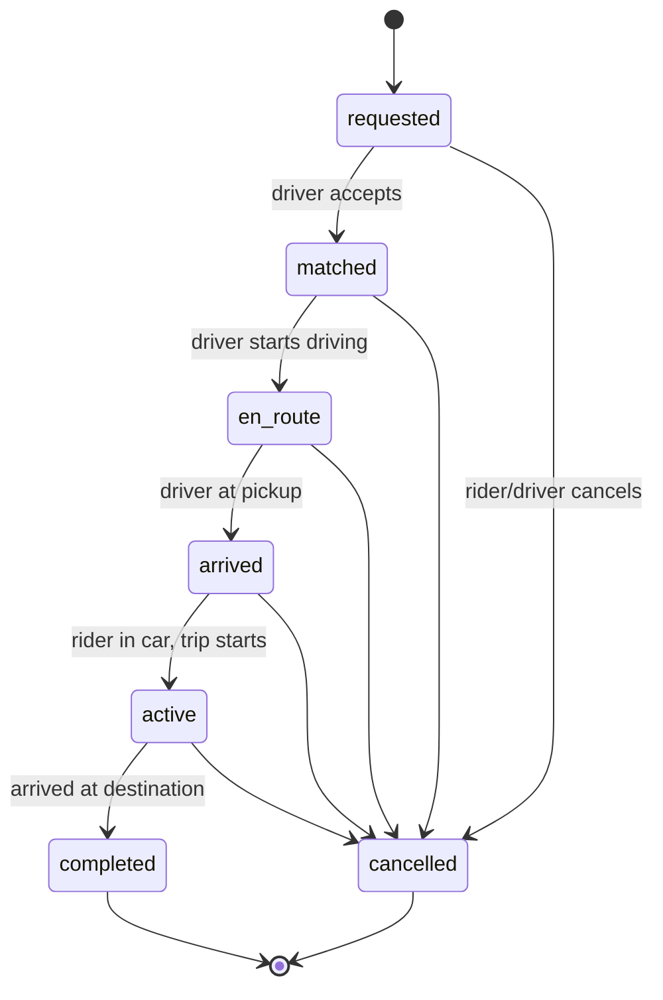
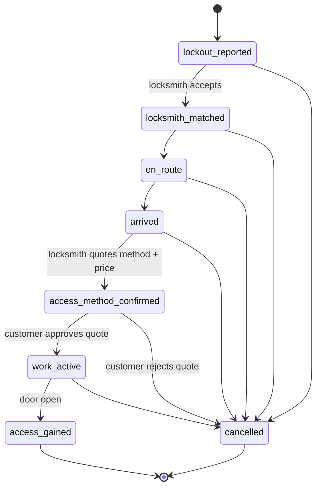
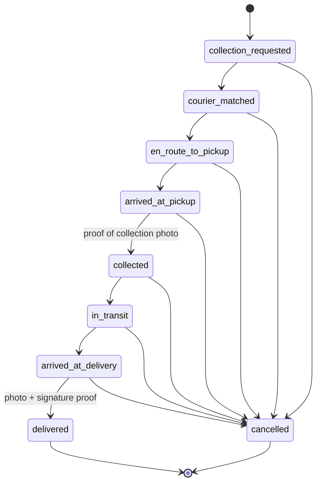
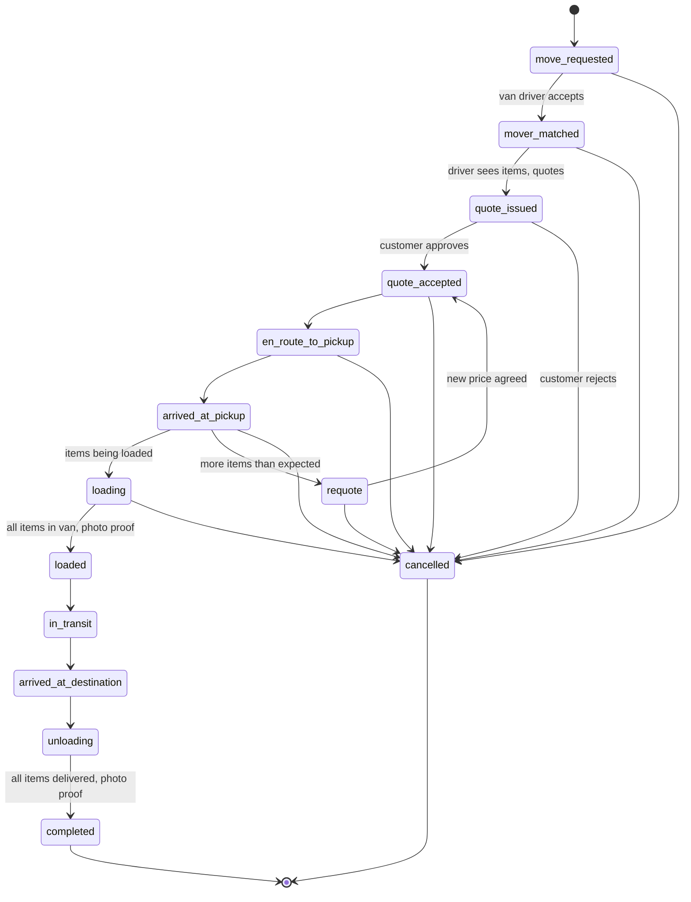
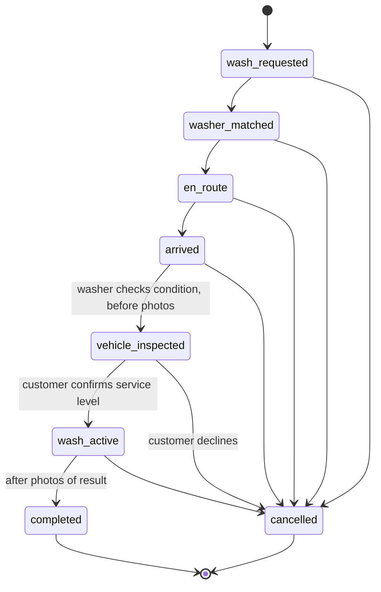
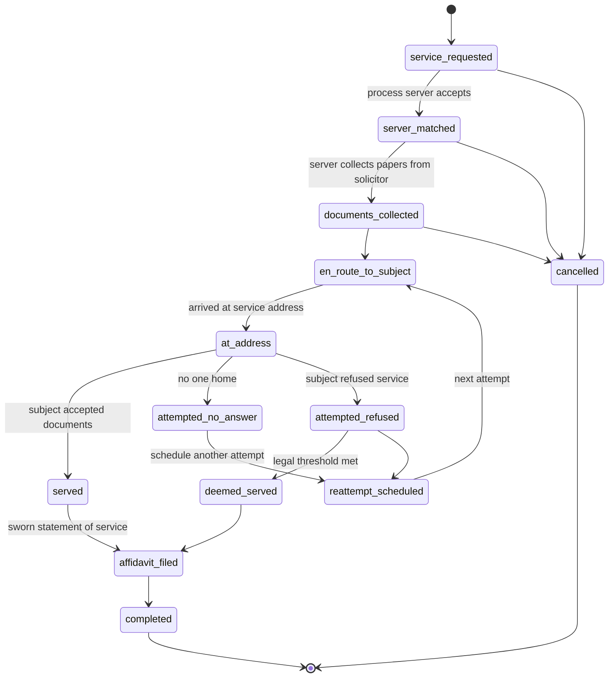
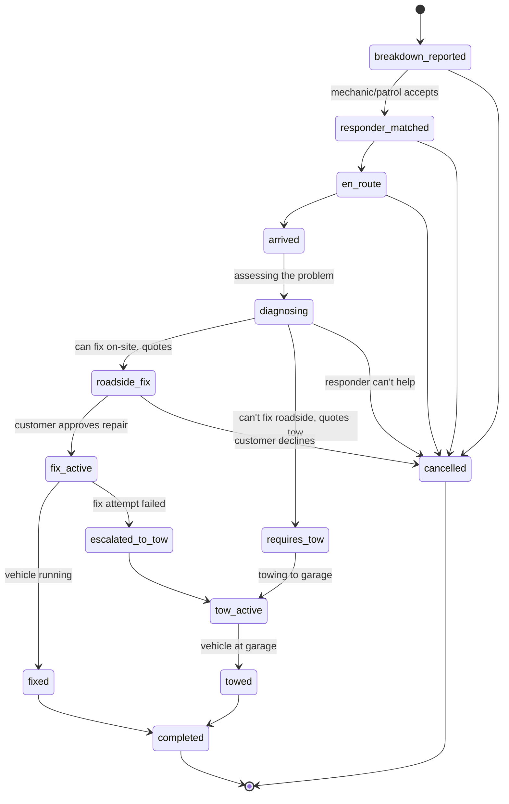
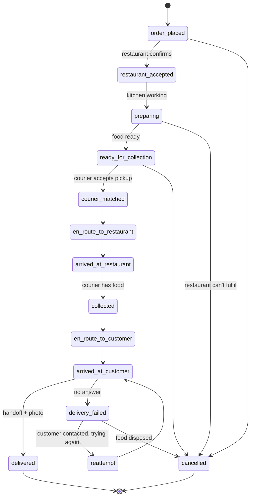
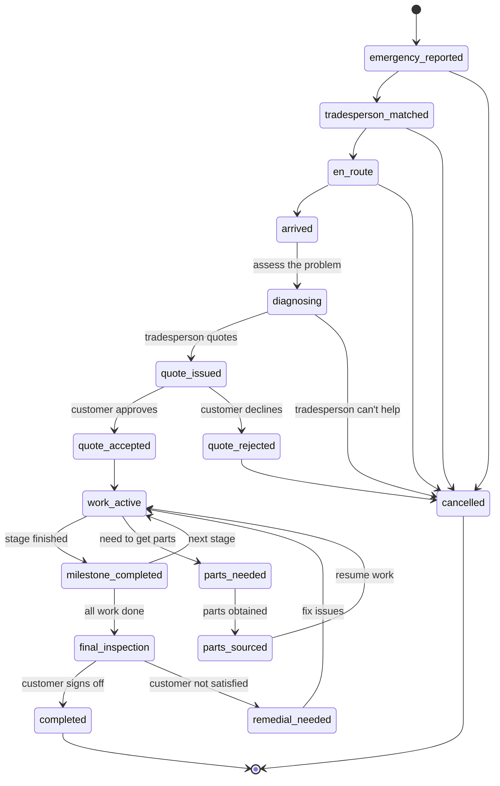
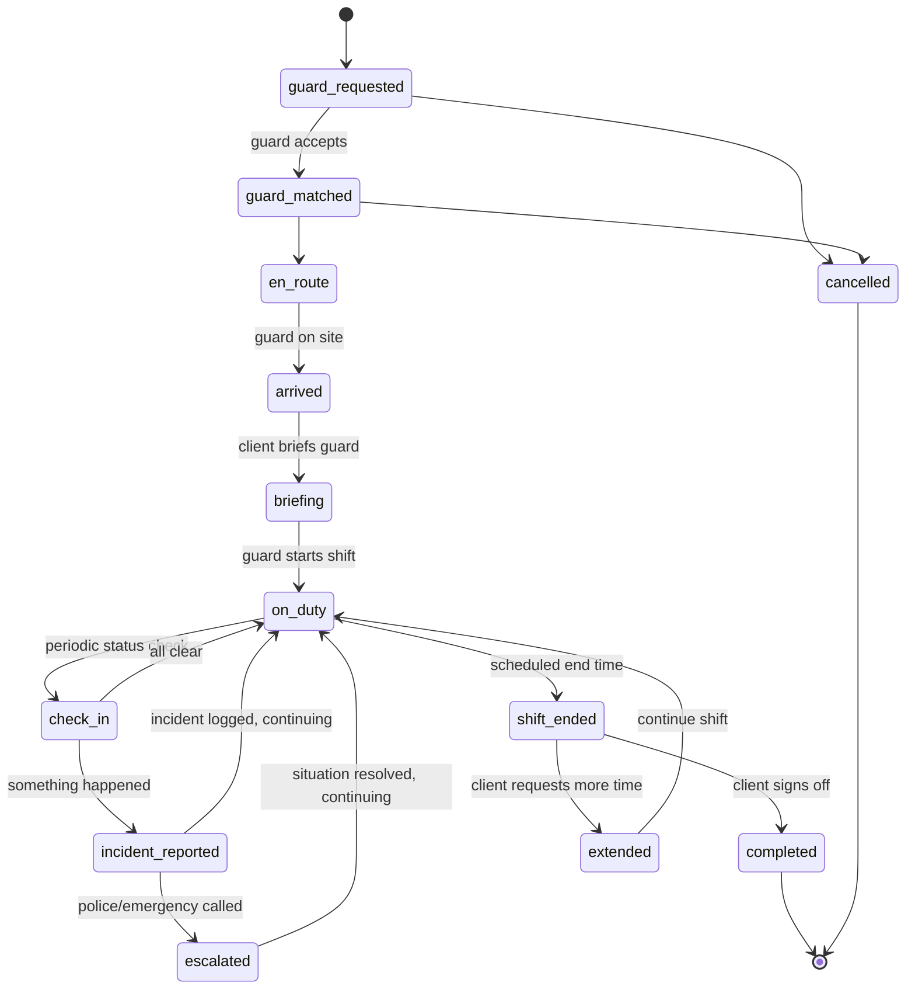

# Protocol Redesign: Payment Agnosticism, Modular NIPs, Decentralisation & Use Case State Machines

**Date**: 2026-02-08
**Status**: Design (awaiting approval)
**Scope**: Full documentation rewrite, protocol architecture changes, NIP restructuring

---

## Table of Contents

1. [Overview](#1-overview)
2. [Payment Agnosticism](#2-payment-agnosticism)
3. [Modular NIP Specification Family](#3-modular-nip-specification-family)
4. [NIP Ecosystem Audit](#4-nip-ecosystem-audit)
5. [Decentralisation Push](#5-decentralisation-push)
6. [GDPR Compliance Strategy](#6-gdpr-compliance-strategy)
7. [Use Case State Machines](#7-use-case-state-machines)
8. [Protocol Gaps & New Primitives](#8-protocol-gaps--new-primitives)
9. [Documentation Rewrite Plan](#9-documentation-rewrite-plan)

---

## 1. Overview

This document captures the design decisions for a major protocol evolution. The changes affect every layer of DonkeyRide: the NIP specification, the payment system, the operator's role, and the documentation.

### Design Principles

- **Protocol-level payment agnosticism** — the NIP spec becomes currency-neutral. Lightning is one provider among many.
- **Trust transparency** — every payment provider declares its trust model. Users choose their risk tolerance.
- **Maximum decentralisation within legal constraints** — move everything off the operator that isn't legally mandated.
- **Modular NIPs** — split the monolithic 82-kind spec into a family of focused specifications.
- **Real-world state machines** — every use case state machine must survive contact with reality.

### Key Decisions Made

| Decision | Choice | Rationale |
|----------|--------|-----------|
| Payment scope | Protocol-level agnosticism | If DonkeyRide is a protocol like HTTP, coupling it to one payment rail limits adoption |
| Trust model | Trust profiles per provider | Each provider declares its trust level; the market decides |
| State machine documentation | Top 10 with diagrams + real-world sense check | Depth over breadth surfaces protocol gaps |
| NIP structure | Full modular rewrite | Family of focused NIPs, each domain profile declares which it uses |
| GDPR approach | Push decentralisation further | Move PII exchange, stakes, and coordination off the operator |
| Documentation | Everything in one pass | All docs rewritten together for consistency |

---

## 2. Payment Agnosticism

### Core Change

The protocol becomes currency-neutral. Every event schema that currently uses `amount` (implicitly in satoshis) gains explicit currency and trust model tags:

```json
["amount", "1500"],
["currency", "GBP"],
["trust_model", "custodial-escrow"]
```

The `currency` tag uses ISO 4217 codes for fiat (GBP, USD, EUR) and well-known codes for crypto (BTC, SAT, ETH). The `trust_model` tag is set by the payment provider and is informational — it tells participants what trust assumptions apply.

### Design Principle: Bitcoin Rails, Fiat UX

Most customers won't care about Lightning or Bitcoin. The ideal flow:

1. Customer sees "pay £12.50" on their card
2. Strike (or similar) converts to sats, sends over Lightning
3. Provider receives sats (or cashes out to fiat instantly)
4. The customer paid in GBP, the provider received GBP — no taxable crypto event for either party
5. The protocol got Lightning's speed and low fees

For users who want full Bitcoin: NIP-47 (Nostr Wallet Connect) lets them connect their own wallet directly. Hold invoices for trustless stakes. No intermediary needed.

### Payment Provider Interface Changes

The base provider interface gains:

```javascript
// New methods
supportedCurrencies()    // ['GBP', 'USD', 'EUR', 'SAT', 'BTC']
trustModel()             // 'trustless' | 'custodial' | 'custodial-escrow' | 'federated' | 'smart-contract'

// Amount becomes a value+currency pair throughout
lockStake(taskId, userId, { value: 1500, currency: 'GBP' }, type)
```

### Trust Model Transparency

Each payment method declares its trust model, visible to all participants:

| Provider | Trust Model | Description | Best For |
|----------|------------|-------------|----------|
| NIP-47 + hold invoices | `trustless` | User wallet ↔ user wallet. Operator cannot touch funds. | High-value jobs, sovereignty-minded users |
| Strike | `custodial-third-party` | Strike holds funds briefly during conversion. Operator never has custody. | Fiat UX users, everyday transactions |
| Stripe Escrow | `custodial-escrow` | Stripe holds funds in escrow until service completion. | Fiat-only markets, regulatory compliance |
| LND (operator node) | `custodial-operator` | Operator's Lightning node holds hodl invoices. | Operators with own Lightning infrastructure |
| Cashu/Fedimint | `federated` | Ecash mint or federation holds funds. Multi-party custody. | Privacy-focused users |
| PayPal/Bank Transfer | `custodial-third-party` | Traditional payment processor holds funds. | Maximum accessibility |

### What This Enables

- A London locksmith operator runs Stripe — customers pay in GBP, stakes held in Stripe escrow (`custodial-escrow`)
- A Bitcoin-native rideshare operator runs NIP-47 — users pay in sats, stakes are hold invoices (`trustless`)
- A European delivery operator runs SEPA + Cashu — payments in EUR, stakes in Cashu tokens (`federated`)
- Mixed: an operator offers multiple payment methods and the user chooses, seeing the trust trade-off

---

## 3. Modular NIP Specification Family

### Current Problem

`NIP-XX-ridesharing.md` is a single ~8,000-line file defining 82 event kinds. It's still called "ridesharing" despite the protocol being domain-agnostic. 82 kinds in one NIP is unusual — most NIPs define 1-5 kinds. The spec mixes normative protocol requirements with non-normative implementation guidance.

### Proposed Structure

The monolithic spec becomes a family of focused specifications. The naming shifts from "ridesharing" to **"service coordination"**.

| Spec | Kinds | Scope | Lines (est.) |
|------|-------|-------|-------------|
| **NIP-XX-core** | 30500-30509 | Service request, acceptance, status updates, completion, cancellation. The minimum viable protocol. Currency-neutral. | ~500 |
| **NIP-XX-stakes** | 30502-30503, 30520-30521 | Commitment stakes — lock, negotiate, release, forfeit. Trust model tags. Payment-provider-agnostic. | ~400 |
| **NIP-XX-reputation** | 30530-30531 | Ratings, reputation queries. Domain-agnostic rating criteria via tags. References NIP-85 for computed summaries. | ~300 |
| **NIP-XX-disputes** | 30522, 30524, 30550-30555 | Disputes, resolutions, theft reports, guardian voting, slashing. | ~500 |
| **NIP-XX-discovery** | 30525, 30540 | Service areas, operator bonds, provider availability. Geohash-based discovery. References NIP-89 for app handlers. | ~300 |
| **NIP-XX-safety** | 30560-30565 | Emergency alerts, trip sharing, safety check-ins, harassment reports. | ~400 |
| **NIP-XX-navigation** | 30580-30585 | Routes, instructions, traffic, reroutes. | ~300 |
| **NIP-XX-payments** | 30510, 30538 | Streaming payments, payment failures, tips, surcharges. Currency-neutral. References NIP-57 for zap-based tips. | ~300 |

Each NIP stands alone and can be implemented independently. Each domain profile declares which NIPs it uses:

```
Ridesharing:      core + stakes + reputation + discovery + safety + navigation + payments
Locksmith:        core + stakes + reputation + discovery
Parcel delivery:  core + stakes + reputation + discovery + navigation + payments
Court serving:    core + reputation + discovery
Security guard:   core + stakes + reputation + discovery + safety + payments
```

### Kind Range

The range **30500-30599 is confirmed clear** — no conflicts with any existing NIP. The nearest occupied kinds are NIP-99 at 30402-30403 and NIP-34 at 30617-30618.

**Bug fix**: QUICK-REFERENCE.md says 30500-30699 but the spec says 30500-30599. Resolve to 30500-30599 as the primary range. Kinds 30600-30616 are available for domain extensions (locksmith quote kinds 30601-30605 already use this space).

---

## 4. NIP Ecosystem Audit

### NIPs We MUST Adopt

| NIP | What | Current State | Action |
|-----|------|--------------|--------|
| **NIP-40** | Expiration timestamps | Custom `expiry` tag | Rename to standard `["expiration", "<unix-timestamp>"]`. Relays already understand NIP-40; none understand our custom tag. |
| **NIP-44** | Encrypted payloads | Not yet implemented | Must use for all encrypted coordination. NIP-04 is deprecated. |
| **NIP-17 + NIP-59** | Private messages (gift wrap) | WebSocket only | Use for private rider-driver coordination via Nostr. Three-layer wrapping hides sender, recipient, and timestamps. |

### NIPs We SHOULD Adopt

| NIP | What | Benefit |
|-----|------|---------|
| **NIP-47** | Nostr Wallet Connect | Users bring their own wallet. `make_hold_invoice` / `settle_hold_invoice` / `cancel_hold_invoice` maps to our lock/release/forfeit. Decentralised Strike equivalent. |
| **NIP-57** | Lightning Zaps | Riders zap the driver's completion event for tips. Every Nostr client already supports this. |
| **NIP-58** | Badges | "Background Check Passed", "SIA Licensed", "Gas Safe Registered" as standard Nostr badges visible across the ecosystem. |
| **NIP-89** | App handler registration | When someone sees a kind 30500 event in any Nostr client, it says "open with DonkeyRide". |
| **NIP-85** | Trusted assertions | Publish reputation summaries in a format the wider Nostr ecosystem understands. |
| **NIP-56** | Reporting | Standard user reporting for the broader Nostr network, complementing internal dispute kinds. |

### NIPs Already Adopted Correctly

- **NIP-33** — parameterised replaceable events (d tags)
- **NIP-98** — HTTP Auth (kind 27235)

### What's Genuinely Novel

These are DonkeyRide innovations with no NIP equivalent:

1. **Real-time service coordination state machine** — parameterised by domain profile
2. **Commitment stakes / escrow pattern** — lock/release/forfeit lifecycle
3. **Streaming payments** — per-second/per-metre continuous payment
4. **Operator bonds + guardian slashing** — multi-party accountability
5. **Domain-agnostic service profiles** — one protocol, many use cases
6. **Geohash real-time discovery** — dynamic provider availability
7. **Cross-operator coordination** — federating tasks across operators

---

## 5. Decentralisation Push

### Current Operator Responsibilities (7 things)

1. Stake custody (hodl invoices)
2. PII storage (addresses, GPS traces, payment history)
3. Coordination messages (status updates, ETAs)
4. Real-time location streaming (WebSocket)
5. 24/7 safety monitoring (humans)
6. Background checks (Checkr/Onfido integration)
7. Insurance coordination (legal entity)

### What Moves Off the Operator (3 things)

#### 5.1 Stake Custody → NIP-47 (Nostr Wallet Connect)

The biggest decentralisation win. With NIP-47:

```
CURRENT:   Rider Wallet → Operator Lightning Node → Driver Wallet
           (operator has temporary custody)

PROPOSED:  Rider Wallet ←NIP-47→ Driver Wallet
           (hold invoice directly between parties)
           Operator role: triggers settlement by publishing signed completion event
           Operator custody: NONE
```

NIP-47 already supports `make_hold_invoice`, `settle_hold_invoice`, `cancel_hold_invoice` — our exact lock/release/forfeit lifecycle.

For fiat users via Strike: Strike holds funds (not the operator). Trust model: `custodial-third-party`.

#### 5.2 PII Exchange → NIP-17 + NIP-59 (Gift Wrap)

```
CURRENT:   Rider → Operator DB → Driver
           (operator sees and stores all PII)

PROPOSED:  Rider → [NIP-59 Gift Wrap] → Nostr Relay → Driver
           (operator can't read it, relay can't read it)
```

Three-layer wrapping (rumour → seal → gift wrap) hides sender, recipient, and timestamps from relay operators. The operator never sees exact addresses, phone numbers, or real names.

GDPR compliance via crypto-shredding: when a user exercises right to erasure, destroy the encryption key pair. The ciphertext remains on relays but is indecipherable.

#### 5.3 Coordination Messages → Encrypted Nostr Events

Status updates, ETAs, "I'm outside" messages — currently go through the operator's WebSocket. These become NIP-44 encrypted events published to Nostr, removing the operator from the conversation.

### What Can Be Thinned (2 things)

#### 5.4 Real-time Location → Ephemeral Nostr Events (Optional)

Nostr event kinds 20000-29999 are ephemeral — relays MUST NOT store them. Live GPS streaming could use ephemeral encrypted events instead of the operator's WebSocket.

Trade-off: latency. Nostr relay round-trip may be slower than a direct WebSocket. Offered as an option — privacy-maximising users choose ephemeral Nostr, UX-maximising users choose operator WebSocket.

#### 5.5 Dispute Resolution → Guardian Network (Partial)

Guardian voting (kinds 30553-30554) is designed but not implemented. Simple disputes (rider says driver didn't show, GPS proves otherwise) can be automated. Complex disputes still need human arbitration.

### What MUST Stay (2 things)

#### 5.6 Safety Monitoring

Legal requirement in most jurisdictions. Needs humans who can call 999/911 within 60 seconds. Cannot be decentralised.

Mitigation: emergency alerts (kind 30559) published to Nostr as well as sent to the operator, so multiple parties can respond.

#### 5.7 Background Checks + Insurance

Requires a legal entity to integrate with screening services and hold insurance policies.

Mitigation: results published to Nostr as NIP-58 badges, so verification is decentralised even if checking isn't.

### New Decentralisation Scorecard

| Function | Current | Proposed | Change |
|----------|---------|----------|--------|
| Discovery | Nostr (decentralised) | No change | — |
| Reputation | Nostr (decentralised) | + NIP-85 summaries | Enhancement |
| Stake custody | Operator (centralised) | **NIP-47 user wallets** | Decentralised |
| PII exchange | Operator DB (centralised) | **NIP-17 gift wrap** | Decentralised |
| Coordination | Operator WebSocket | **NIP-44 encrypted Nostr** | Decentralised |
| Live tracking | Operator WebSocket | **Ephemeral Nostr (optional)** | Optional decentralisation |
| Safety monitoring | Operator humans | No change | Legally required |
| Background checks | Operator + third party | No change | Legally required |

### Updated Architecture Description

```
BEFORE:
  Decentralised:  Nostr (discovery + reputation)
  Centralised:    Operator (PII + stakes + coordination + safety + checks)
  Decentralised:  Lightning (payments)

AFTER:
  Decentralised:  Nostr (discovery + reputation + PII exchange + coordination)
  Decentralised:  NIP-47 / Strike / Payment providers (payments + stakes)
  Minimal:        Operator (safety monitoring + background checks + insurance)
```

The operator becomes a thin compliance layer — handling only what the law mandates. Everything else runs on decentralised rails.

---

## 6. GDPR Compliance Strategy

### Legal Research Summary

| Question | Regulatory Position | Source |
|----------|-------------------|--------|
| Does crypto-shredding satisfy Article 17 (right to erasure)? | **Probably yes.** CNIL endorses it as "coming closer to compliance." EDPB (April 2025 guidelines) recommends storing only hashes/commitments/ciphertexts on-chain. No authority has ruled it insufficient. | CNIL blockchain guidance; EDPB Guidelines 02/2025 |
| Are Nostr pubkeys personal data? | **Yes.** Pseudonymous identifiers are explicitly personal data under GDPR Recital 26 and the CJEU *Breyer* ruling (C-582/14). | CJEU *Breyer v Bundesrepublik*; CNIL blockchain guidance |
| Who is the data controller? | **The user** who publishes events is the primary controller (CNIL). The operator is a controller for PII they collect. Relay operators are processors or independent controllers depending on their decision-making role. | CNIL blockchain guidance; EDPB Guidelines 02/2025 |
| Is NIP-44 ciphertext on a relay "personal data"? | **For the keyholder, yes. For the relay without keys, likely not** (for the content). But metadata (pubkeys, timestamps) IS personal data regardless. | ICO encryption guidance; IAPP analysis |
| UK GDPR differences? | **Substantively aligned with EU GDPR.** ICO uses a "motivated intruder" test. Data (Use and Access) Act 2025 clarifies but does not materially change the framework. | ICO anonymisation guidance (March 2025); DUA Act 2025 |

### Compliance Architecture

#### Layer 1: Nostr (Public/Pseudonymous)

**What goes on Nostr:**
- Pseudonymous pubkeys (personal data, but lawful basis: legitimate interest for service coordination)
- Obfuscated geohash locations (precision 5 = ~5km area, not exact)
- Ratings and reputation (pseudonymous, crypto-shredding for erasure)
- Operator bonds (public accountability)
- Service areas and availability (operational data)
- Encrypted PII exchange (NIP-17 gift wrap — relay can't read content)

**GDPR measures:**
- Data minimisation: only pseudonymous identifiers on public events
- Crypto-shredding: destroy key pair to render encrypted data unreadable
- NIP-62 (Request to Vanish): relay-side deletion of all events for a pubkey
- NIP-40: expiration timestamps for automatic cleanup of time-limited events

#### Layer 2: Operator (Private/Compliant)

**What stays with the operator:**
- Safety monitoring records (legal obligation to retain)
- Background check results (legal obligation, 7-year retention for some)
- Insurance documentation (regulatory requirement)
- Compliance audit trails (tax law, 7-year retention)

**GDPR measures:**
- Standard controller obligations: lawful basis, retention policies, deletion on request
- Data Protection Impact Assessment (DPIA) required before deployment
- Data Processing Agreements with any sub-processors
- Right to erasure honoured for all operator-held data (except where legal retention overrides)

#### Layer 3: Payment Providers (Third Party)

**What payment providers hold:**
- Transaction records (their own controller obligations)
- KYC data if applicable (e.g. Strike, Stripe)

**GDPR measures:**
- Each provider is an independent controller or processor depending on relationship
- Operator must have DPA with each payment provider
- NIP-47 (trustless): no payment data touches the operator at all

### Right to Erasure Implementation

When a user exercises Article 17:

1. **Operator**: delete all PII from PostgreSQL (addresses, GPS traces, chat messages, photos)
2. **Nostr encrypted events**: destroy the user's encryption key pair (crypto-shredding). Ciphertext remains but is indecipherable.
3. **Nostr public events**: submit NIP-62 Request to Vanish to all relays the operator controls. Request deletion from known third-party relays.
4. **Ratings/reputation**: these are published by OTHER users about this user. Under GDPR, the rating publisher is the controller. The operator can request relay deletion but cannot force it for events signed by other pubkeys.
5. **Payment records**: retain for 7 years (legal obligation under tax law overrides right to erasure per Article 17(3)(b)).

### Recommendations for Operators

- Run NIP-62-compliant relays for all operator-published events
- Implement crypto-shredding as the default erasure mechanism for encrypted Nostr data
- Conduct a DPIA before deploying any DonkeyRide operator
- Maintain a Record of Processing Activities (ROPA) per Article 30
- Appoint a DPO if processing personal data at scale
- Update the privacy notice to explain the three-layer architecture and what data goes where

---

## 7. Use Case State Machines

### Existing Profiles — Sense Check

#### 7.1 Ridesharing (DonkeyRide)



**Roles**: rider / driver | **Pricing**: distance + time + surge | **Discovery**: geohash

**Gaps identified:**
- **No `no_show` state.** Driver arrives, rider doesn't appear. Currently modelled as `cancelled` from `arrived`, but a no-show should trigger stake forfeiture while a mutual cancellation should not. The cancellation event needs a `reason` tag that distinguishes these, or a dedicated `no_show` terminal state.
- **`active` → `cancelled` ambiguity.** A driver stopping mid-ride is a safety incident, not a normal cancellation. Consider whether this transition needs a `reason` tag or a separate `abandoned` state.
- **Mid-ride destination change** — not a state concern. Handle as a price renegotiation event within the `active` state.

**Rating criteria**: Overall (40%), Punctuality (20%), Safety (20%), Courtesy (20%)

---

#### 7.2 Locksmith (DonkeyKnock)



**Roles**: customer / locksmith | **Pricing**: flat rate (quoted) | **Discovery**: geohash

**Gaps identified:**
- **No back-transition for failed attempts.** Locksmith tries picking (fails), needs to re-quote for drilling. The state machine doesn't allow `work_active` → `access_method_confirmed`. This is essential — drilling costs 3x picking and the customer must approve.
- **Guarantee period** — feature is enabled but no state models it. If the lock fails within 30 days, should the task be reopened or a linked follow-up task created? Recommendation: linked task with a reference to the original.

**Rating criteria**: Overall (30%), Punctuality (20%), Price transparency (30%), Skill (20%)

---

#### 7.3 Parcel Delivery (DonkeyPack)



**Roles**: sender / courier | **Pricing**: distance + time + surge | **Discovery**: geohash

**Gaps identified:**
- **No `delivery_failed` state.** Nobody home at delivery address — the #1 real-world problem. Options: leave with neighbour, leave in safe place, return to sender, reattempt. None modelled.
- **No `returned_to_sender` state.** If delivery fails after multiple attempts, the parcel goes back. Needs a transition from `delivery_failed` back towards origin.
- **Cancellation after `collected` is problematic.** The courier has the parcel — you can't just cancel. Need forced return-to-sender semantics. Cancellation after custody transfer should trigger a different flow than pre-custody cancellation.

**Rating criteria**: Overall (30%), Punctuality (25%), Package care (25%), Communication (20%)

---

### New Profiles — Detailed Design

#### 7.4 Man with Van / House Removal (DonkeyHaul)



**Roles**: customer / mover | **Pricing**: quote-based | **Discovery**: geohash

**Key design decisions:**
- **`requote` loop** — essential. Customers understate job size; movers inflate on arrival. Having an explicit requote state with photo evidence prevents both scams.
- **`loading` and `unloading` as separate states** — damage claims need to know when damage occurred. Photos at `loaded` (everything in) and `completed` (everything out) create an evidence trail.
- **`loading` → `requote`** should also be allowed — items won't fit, need a second trip or bigger van.
- **Cancellation after `loading`** — the mover has your belongings. Force an `unloading` → return items flow.

**Completion proof**: photos of items loaded + photos of items unloaded
**Dispute evidence**: text, photos, GPS trace, inventory list

**Features**: navigation, live tracking, tipping, photos, quote negotiation. No streaming payments (lump sum). No signatures (unless high value).

**Rating criteria**: Overall (25%), Punctuality (20%), Care of items (30%), Value for money (25%)

**Regulatory**: Consumer Rights Act 2015 (goods-in-transit liability). No mandatory licensing for van drivers in the UK.

---

#### 7.5 Mobile Car Wash (DonkeyShine)



**Roles**: customer / washer | **Pricing**: flat rate (tiered: basic/standard/premium) | **Discovery**: geohash

**Key design decisions:**
- **`vehicle_inspected` state** — before/after photos are standard industry practice. The "before" photo protects the washer from "you scratched my car" claims. The "after" photo proves work was done.
- **Simple state machine, intentionally.** Car washing is straightforward — no custody transfers, no complex failure modes.
- **Tiered pricing** (basic exterior, full valet) is metadata on the request, not a state machine concern.
- **No destination needed** — washer comes to the car's location.

**Edge cases:**
- Rain during wash: `wash_active` → `cancelled` needs partial completion and partial payment semantics.
- Pre-existing damage: `vehicle_inspected` photos establish baseline for dispute evidence.

**Completion proof**: before/after photos
**Dispute evidence**: text, photos

**Features**: navigation, live tracking, tipping, photos. No streaming, no signatures, no quote negotiation.

**Rating criteria**: Overall (30%), Quality (35%), Punctuality (20%), Value (15%)

**Regulatory**: Minimal. Environmental regulations on water run-off may apply in some areas.

---

#### 7.6 Court Process Serving (DonkeyServe)



**Roles**: instructing party / process server | **Pricing**: flat rate + per-attempt | **Discovery**: geohash

**Key design decisions:**
- **Cryptographic proof of service is stronger than paper.** GPS proof of being at the address, timestamped photo/video, signed Nostr events — an immutable, verifiable evidence chain that courts would accept.
- **`attempted_no_answer` → `reattempt_scheduled` loop** — process servers typically make 3-4 attempts at different times of day.
- **`attempted_refused` → `deemed_served`** — jurisdiction-dependent. In England & Wales (CPR Part 6), refusal to take documents can still constitute valid service if the server explains what the documents are. The protocol needs jurisdiction-aware rules.
- **`affidavit_filed` as mandatory state** before completion — ensures legal paperwork is done. The Nostr event trail essentially IS the affidavit.
- **Encryption is MANDATORY** — court documents contain highly sensitive information. All document exchange via NIP-17 gift wrap. `encryptionRequired: true` in the profile.

**Edge cases:**
- Substituted service: if personal service fails repeatedly, the court may order service by post, email, or social media. This bypasses the location-based flow — model as a state branch from `reattempt_scheduled` to `substituted_service`.
- Evasion: subject actively avoids service. The attempt loop handles this, with the `reattempt_scheduled` state tracking attempt count.

**Completion proof**: GPS coordinates at each attempt + timestamped photos + signed event chain
**Dispute evidence**: full event trail (each attempt is a Nostr event)

**Features**: navigation, live tracking, photos. No streaming payments, no tipping, no safety alerts (but operator monitoring for process server safety).

**Rating criteria**: Overall (25%), Reliability (30%), Evidence quality (25%), Communication (20%)

**Regulatory**: Courts Act 2003, CPR Part 6 (England & Wales). Process servers are not specifically regulated but must comply with court rules.

---

#### 7.7 Roadside Assistance (DonkeyRescue)



**Roles**: motorist / responder | **Pricing**: diagnosis free, then quoted | **Discovery**: geohash + road network

**Key design decisions:**
- **Diagnostic fork** (`roadside_fix` vs `requires_tow`) — the AA/RAC model: arrive, diagnose, attempt roadside fix, tow if needed. The fork lets the customer see a quote and decide.
- **`escalated_to_tow`** — roadside fix attempted but failed. Common scenario: jump-start fails because alternator is dead.
- **Safety is critical** — breakdowns happen on motorways. `safetyAlerts` must be enabled. Live location sharing automatic. GPS precision matters — hard shoulder vs lane 1 is life-or-death.

**Edge cases:**
- Parts ordering: "I can fix it but I need a part — back in 2 hours." Needs a `parts_needed` pause state (as designed for emergency trades, section 7.9).
- Relay service: if the car can't be fixed and the motorist is far from home, onward travel is needed. Model as a linked task (spawn a rideshare or taxi task from the completed breakdown task).
- Wrong responder type: a tyre specialist can't fix an engine. Matching needs skill/equipment tags, not just proximity.

**Completion proof**: GPS arrival + diagnostic notes + photo of fix/tow
**Dispute evidence**: text, photos, GPS trace, diagnostic report

**Features**: navigation, live tracking, tipping, safety alerts, photos, quote negotiation. No streaming payments. No signatures.

**Rating criteria**: Overall (25%), Response time (30%), Diagnostic accuracy (25%), Communication (20%)

**Regulatory**: Minimal for breakdown response. Towing may require operator licensing in some jurisdictions.

---

#### 7.8 Food Delivery (DonkeyEats)



**Roles**: customer / courier (+ restaurant as third party) | **Pricing**: distance + flat fee | **Discovery**: geohash

**Key design decisions:**
- **Three-party coordination** — customer, restaurant, courier. This is fundamentally different from all other use cases. The restaurant is a third party whose state (`preparing` → `ready_for_collection`) drives the courier matching.
- **Courier enters the flow at `ready_for_collection`**, not at the start. The protocol currently assumes matching happens at the initial request state. Food delivery needs late-binding courier matching.
- **`delivery_failed` → `reattempt` loop** — customer gets a call, comes to the door. Limited attempts before food is disposed.
- **Cancellation after `collected` is waste** — food can't be returned. The cancellation event needs a `liability` tag (who pays: customer, restaurant, or courier?).
- **Time sensitivity is extreme** — hot food goes cold. Matching must consider food prep time + courier ETA so the courier arrives as food is ready.

**Edge cases:**
- Substitutions during `preparing`: "out of chips, is rice OK?" This is a restaurant-customer negotiation within the state, not a state transition.
- Multi-restaurant orders: one courier picks up from two restaurants. Model as multi-pickup variant.
- Food safety: Food Standards Agency hygiene ratings. Provider verification should include food hygiene training.

**Completion proof**: photo of delivery
**Dispute evidence**: text, photos, timestamps (was food late? cold?)

**Features**: navigation, live tracking, tipping (NIP-57 zaps natural fit). No streaming payments. No signatures.

**Rating criteria**: Overall (25%), Speed (30%), Food condition (25%), Communication (20%)

**Regulatory**: Food Standards Agency registration. Food hygiene Level 2 for handlers. Allergen information requirements.

**Protocol gap**: Three-party coordination requires a new primitive — see section 8.

---

#### 7.9 Emergency Trades — Plumber / Electrician / Gas (DonkeyFix)



**Roles**: homeowner / tradesperson | **Pricing**: diagnosis fee + quoted work | **Discovery**: geohash + trade speciality

**Key design decisions:**
- **`parts_needed` → `parts_sourced` loop** — plumbers routinely leave to get parts. Can take hours. Without this state, a 2-hour parts run looks like a no-show.
- **Milestone-based progress** — emergency plumber might: (1) stop the leak, (2) rip out damaged pipe, (3) fit new pipe, (4) test and clean up. Each milestone could trigger partial payment release.
- **`final_inspection` → `remedial_needed`** — the customer rejects work ("it's still leaking"). Tradesperson goes back without starting a dispute.
- **Multiple quotes variant** — for non-emergency work, homeowners want 3 quotes. An auction variant where multiple tradespeople quote and the customer chooses would serve the non-emergency market.

**Edge cases:**
- Gas engineers: Gas Safe registration is a **legal requirement** (Gas Safety (Installation and Use) Regulations 1998). Unregistered gas work is a criminal offence. Profile MUST verify Gas Safe registration before matching.
- Electricians: Part P of Building Regulations requires Building Control notification for certain work.
- Follow-up visits: "Emergency fix done, you'll need proper repair next week." Linked/scheduled task.

**Completion proof**: photos of work + customer sign-off
**Dispute evidence**: text, photos, GPS trace, milestone records, price quotes

**Features**: navigation, live tracking, tipping, photos, quote negotiation, milestone payments. No streaming. Safety alerts for lone worker protection.

**Rating criteria**: Overall (20%), Diagnosis accuracy (25%), Workmanship (25%), Transparency (20%), Tidiness (10%)

**Regulatory**: Gas Safe Register (gas). NICEIC/NAPIT (electrical, voluntary but expected). Building Regulations Part P (electrical). Consumer Rights Act 2015.

**Protocol gap**: Milestone-based escrow — see section 8.

---

#### 7.10 Security Guard Dispatch (DonkeyGuard)



**Roles**: client / security guard | **Pricing**: hourly rate (streaming payments natural fit) | **Discovery**: geohash

**Key design decisions:**
- **Time-based service** — unlike all other use cases, not task-completion-driven. Streaming payments (per-30-seconds) are perfect — the guard gets paid continuously while `on_duty`.
- **`check_in` as a recurring state** — guards should check in every 30-60 minutes. A missed check-in is an alarm condition triggering operator safety response. Maps to existing safety check-in events (kinds 30561-30562).
- **`incident_reported`** needs rich metadata: incident type, photos, police reference number. This is evidence the client is paying for.
- **`briefing` state** — the client tells the guard what to watch for, where access points are, who's authorised. Content encrypted via NIP-17 as it contains security-sensitive premises details.
- **`extended`** — events overrun, situations escalate. Client extends on-the-fly, streaming payment continues.

**Edge cases:**
- Guard handover: multi-shift bookings (24-hour event security) need a handover state where outgoing and incoming guards overlap.
- Patrol routes: mobile patrols visiting multiple sites need NFC/QR checkpoint scanning as proof of patrol.
- SIA licensing is **mandatory** (Private Security Industry Act 2001). Operating without an SIA licence is a criminal offence. Profile MUST verify SIA licence before matching.

**Completion proof**: check-in log + incident reports + shift hours
**Dispute evidence**: check-in timestamps, incident reports, GPS trace, photos

**Features**: navigation, live tracking, safety alerts, streaming payments, photos. No tipping (professional service). No signatures.

**Rating criteria**: Overall (25%), Alertness (25%), Professionalism (25%), Communication (25%)

**Regulatory**: Private Security Industry Act 2001. SIA licensing mandatory. BS 7858 security screening standard.

**Protocol gap**: Session-based heartbeat / periodic check-ins — see section 8.

---

## 8. Protocol Gaps & New Primitives

The use case analysis surfaced 4 protocol gaps that the current architecture doesn't handle. These need addressing in the modular NIP rewrite.

### 8.1 Three-Party Coordination

**Affected use cases**: Food delivery (customer + restaurant + courier)

**Current limitation**: The protocol assumes two-party coordination (requester ↔ provider) with an operator facilitating.

**Proposed solution**: Introduce a `vendor` role alongside `requester` and `provider`. The task lifecycle splits into two phases:
1. **Order phase** (requester ↔ vendor): order placed, accepted, prepared
2. **Delivery phase** (requester ↔ provider): courier matched, collected, delivered

These phases are linked by a shared task ID. The courier task is created automatically when the vendor publishes a "ready for collection" event. The protocol needs:
- A new event kind for vendor status updates (preparing, ready)
- Late-binding provider matching (match at mid-flow, not at request time)
- Three-way rating (customer rates courier AND vendor; courier rates vendor)

### 8.2 Milestone-Based Escrow

**Affected use cases**: Emergency trades, man with van

**Current limitation**: Stakes are binary — lock at start, release at end. The payment provider interface only supports full lock/release/forfeit.

**Proposed solution**: Add milestone support to the payment provider interface:

```javascript
partialRelease(taskId, amount, milestoneId)   // Release portion of stake at milestone
getMilestones(taskId)                          // List milestones and their payment status
```

The domain profile defines milestones for the use case. Each milestone triggers a partial stake release. The final milestone releases the remainder. If the tradesperson abandons mid-job, only completed milestones are paid.

Requires a new event kind for milestone completion (kind 30506 proposed) containing:
- Milestone ID
- Description of work completed
- Amount released
- Photo evidence
- Customer acknowledgement

### 8.3 Re-Quote / Back-Transitions

**Affected use cases**: Locksmith (failed attempt → re-quote), man with van (more items than expected), roadside assistance (fix failed → tow)

**Current limitation**: State machines are strictly forward-progressing. No state allows transitioning back to an earlier state.

**Proposed solution**: Allow specific back-transitions in the domain profile's state machine definition:

```javascript
transitions: {
  'work_active': ['access_gained', 'access_method_confirmed', 'cancelled'],
  //                                ^^^ back-transition for re-quoting
}
```

Back-transitions are explicitly declared, not a general capability. Each back-transition must include a `reason` tag in the status update event. The quote negotiation events (kinds 30601-30602) support multiple rounds.

### 8.4 Session-Based Heartbeat

**Affected use cases**: Security guard dispatch, potentially care/companion services

**Current limitation**: The state machine is task-oriented (linear progression from start to finish). Time-based services need a heartbeat within an active state.

**Proposed solution**: Add a `heartbeat` configuration to the domain profile:

```javascript
heartbeat: {
  enabled: true,
  intervalMinutes: 30,
  missedThreshold: 2,        // missed check-ins before alarm
  alarmAction: 'safety_alert' // triggers kind 30559
}
```

The heartbeat uses the existing safety check-in events (kinds 30561-30562). The operator monitors for missed check-ins. This is not a new NIP — it's a protocol-level configuration that reuses the safety NIP.

### 8.5 No-Show Differentiation

**Affected use cases**: All dispatch use cases

**Current limitation**: `cancelled` from `arrived` could mean mutual cancellation or no-show. These have different stake forfeiture implications.

**Proposed solution**: Add a `no_show` terminal state to use cases where it applies:

```javascript
terminal: ['completed', 'cancelled', 'no_show'],
transitions: {
  'arrived': ['active', 'cancelled', 'no_show'],
}
```

The `no_show` state triggers automatic stake forfeiture for the absent party. The `cancelled` state triggers mutual stake release. The cancellation event's `reason` tag is insufficient — stake forfeiture logic should be driven by state, not by parsing reason strings.

### 8.6 Linked / Follow-Up Tasks

**Affected use cases**: Emergency trades (follow-up repair), roadside assistance (relay service), locksmith (guarantee), court serving (substituted service)

**Current limitation**: Tasks are standalone. No mechanism to spawn a follow-up task linked to a completed one.

**Proposed solution**: Add a `linked_task` tag to the task request event:

```json
["linked_task", "<original_task_id>", "follow_up"],
["linked_task", "<original_task_id>", "guarantee"],
["linked_task", "<original_task_id>", "escalation"]
```

The relationship type (`follow_up`, `guarantee`, `escalation`) determines semantics. Guarantee links inherit the original task's terms. Escalation links (e.g. roadside fix → tow → taxi) form a chain.

---

## 9. Documentation Rewrite Plan

All documentation to be rewritten in one pass for consistency. Every document uses British English spelling throughout.

### Documents to Rewrite

| Document | Current State | Changes |
|----------|--------------|---------|
| **README.md** | Ridesharing-focused | Rewrite as protocol overview. Lead with "service coordination protocol", not ridesharing. Payment-agnostic language. |
| **ARCHITECTURE.md** | Good but needs updating | Update with new decentralisation scorecard. Add NIP-47/NIP-17 architecture. Remove "NIP-04" references (deprecated). Thin operator layer. |
| **TRUST-MECHANISMS.md** | Lightning-specific | Rewrite for payment-agnostic trust profiles. Trust model transparency. Keep 6-layer structure but generalise examples. |
| **STAKING-EXPLAINED.md** | Sats-only | Rewrite for currency-neutral stakes. Add milestone escrow. Add trust model per provider. |
| **QUICK-REFERENCE.md** | Monolithic kind table | Reorganise by NIP module. Fix 30500-30699 range to 30500-30599. |
| **FAQ.md** | Ridesharing-focused | Broaden to cover all use cases. Add payment method FAQ. |

### Documents to Create

| Document | Purpose |
|----------|---------|
| **specs/NIP-XX-core.md** | Core service coordination protocol |
| **specs/NIP-XX-stakes.md** | Commitment stakes specification |
| **specs/NIP-XX-reputation.md** | Rating and reputation |
| **specs/NIP-XX-disputes.md** | Dispute resolution and guardian voting |
| **specs/NIP-XX-discovery.md** | Service discovery and operator bonds |
| **specs/NIP-XX-safety.md** | Safety and emergency events |
| **specs/NIP-XX-navigation.md** | Navigation and routing |
| **specs/NIP-XX-payments.md** | Streaming payments and tips |
| **docs/GDPR-COMPLIANCE.md** | GDPR compliance guide for operators |
| **docs/USE-CASE-STATE-MACHINES.md** | All 10 state machines with Mermaid diagrams |
| **docs/PAYMENT-PROVIDERS.md** | Payment provider integration guide with trust models |

### Documents to Update

| Document | Changes |
|----------|---------|
| **docs/USE-CASES.md** | Add state machines for top 10. Update with new use cases if identified. |
| **PLATFORM-COMPARISON.md** | Update for payment agnosticism. |
| **guides/QUICK-START.md** | Add payment provider setup. Domain selection guide. |
| **guides/OPERATOR-DEPLOYMENT.md** | Add GDPR compliance section. NIP-62 relay requirements. Payment provider configuration. |

### Documents to Retire

| Document | Reason |
|----------|--------|
| **NIP-XX-ridesharing.md** | Replaced by modular specs/ directory |

### Naming Conventions

- Protocol specification files: `specs/NIP-XX-{module}.md`
- Operator guidance: `docs/{TOPIC}.md`
- Developer guides: `guides/{TOPIC}.md`
- Domain profiles: `src/domain-profiles/{domain}.js` (unchanged)

---

## Appendix A: State Machine Pattern Summary

| Pattern | States (typical) | Use Cases | Key Feature |
|---------|-----------------|-----------|-------------|
| **Linear dispatch** | 7 | Ridesharing, mobile car wash | A → B, simple forward progression |
| **Dispatch + quote** | 9-13 | Locksmith, emergency trades, man with van, roadside assistance | Diagnosis/inspection fork, quote negotiation, back-transitions |
| **Pickup → deliver** | 9-11 | Parcel delivery, food delivery | Custody transfer, proof at both ends, delivery failure handling |
| **Attempt loop** | 10 | Court process serving | Multiple attempts with different outcomes, jurisdiction-dependent rules |
| **Continuous session** | 10 | Security guard dispatch | Time-based, periodic heartbeat, extend/end, incident tracking |

## Appendix B: Mandatory Regulatory Checks by Domain

| Domain | Mandatory Check | Regulatory Body | Criminal Offence if Unlicensed |
|--------|----------------|-----------------|-------------------------------|
| Security guard | SIA licence | Security Industry Authority | Yes |
| Gas engineer | Gas Safe registration | Gas Safe Register | Yes |
| Electrician | Part P notification (some work) | Building Control | No (but non-compliant) |
| Court process serving | None (but must follow CPR) | Courts | No |
| Food delivery | Food hygiene registration | Food Standards Agency | Yes (if handling food) |
| Locksmith | None (UK unregulated) | MLA (voluntary) | No |
| Ridesharing | PHV licence (some jurisdictions) | Local authority | Yes (in regulated areas) |
| Parcel delivery | None for same-day | — | No |
| Man with van | None | — | No |
| Mobile car wash | None | — | No |

## Appendix C: Payment Provider Trust Model Matrix

| Provider | Trust Model | Currencies | Custody | Trustless Stakes | Best For |
|----------|------------|------------|---------|-----------------|----------|
| NIP-47 (hold invoices) | `trustless` | SAT/BTC | None (user wallets) | Yes | Sovereignty-minded users |
| Strike | `custodial-third-party` | GBP/USD/EUR/SAT | Strike (brief) | No | Fiat UX, everyday use |
| Stripe | `custodial-escrow` | Any fiat | Stripe escrow | No | Fiat-only markets |
| LND (operator) | `custodial-operator` | SAT | Operator node | Yes (hodl) | Operators with Lightning infra |
| Core Lightning | `custodial-operator` | SAT | Operator node | Yes (hold) | Operators with CLN infra |
| BTCPay Server | `custodial-operator` | SAT/BTC | Operator BTCPay | No | Self-hosted operators |
| Alby | `custodial-third-party` | SAT/EUR/USD | Alby | No | Browser wallet users |
| Cashu | `federated` | SAT (ecash) | Mint | Partial | Privacy-focused users |
| Fedimint | `federated` | SAT | Federation | Partial (multisig) | Community-run federations |
| PayPal | `custodial-third-party` | Any fiat | PayPal | No | Maximum accessibility |
| Bank transfer | `custodial-none` | Any fiat | None (direct) | No | Simple, no intermediary |
| Demo | `mock` | SAT (virtual) | None | N/A | Testing only |
